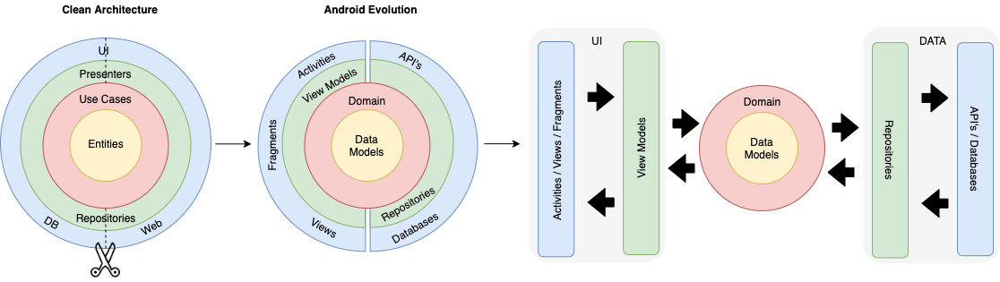

# ma-starter-android
Android application starter project

## Clean architecture with 3 layers
- Data (for database, API and preferences code)
- Domain (for business logic and models)
- Presentation (for UI logic, with MVVM)

 

## Languages, libraries and tools used

* [Kotlin](https://kotlinlang.org)
* Android Support Libraries
* [Coroutines](https://kotlinlang.org/docs/reference/coroutines-overview.html)
* [Koin](https://insert-koin.io)
* [Glide](https://github.com/bumptech/glide)
* [Retrofit](http://square.github.io/retrofit/)
* [OkHttp](http://square.github.io/okhttp/)
* [Timber](https://github.com/JakeWharton/timber)
* [Mockito](http://site.mockito.org/)
* [Espresso](https://developer.android.com/training/testing/espresso/index.html)
* A single-activity architecture, using the **[Navigation component](https://developer.android.com/guide/navigation/navigation-getting-started)** to manage fragment operations.